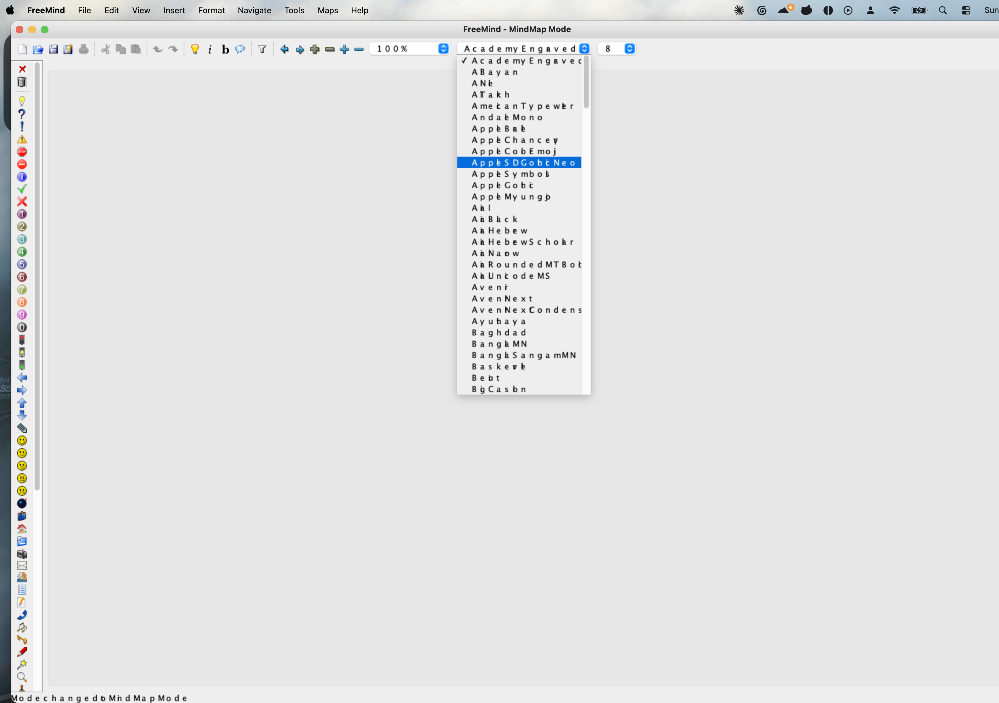

# Setup: FreeMind 1.0.1 on Apple Silicon

macOS 26.5.1 on arm64, FreeMind 1.0.1 from the SourceForge dmg.

The stock build launches under Rosetta, but its bundled Java 7 cannot render text on macOS 26.
Narrow glyphs (i, l, r, t) are clipped away and spacing is wrong, leaving the UI unreadable.
It has to be repointed at a modern JDK.



Stock build on Java 7. Note `Al Bayan` rendered as `A Bayan` and the status bar reading `Mode changed o MindMap Mode`.

```bash
brew install openjdk@21

cd /Applications/FreeMind.app/Contents/Java
cp -n freemind.jar freemind.jar.orig
zip -d freemind.jar 'accessories/plugins/MacChanges*'
```

Replace `Contents/MacOS/JavaAppLauncher` with:

```sh
#!/bin/sh
JAVA=/opt/homebrew/opt/openjdk@21/bin/java
APP="$(cd "$(dirname "$0")/.." && pwd)"
cd "$APP/Java" || exit 1
exec "$JAVA" -Djava.security.manager=allow -Dapple.laf.useScreenMenuBar=true \
  -Xdock:name=FreeMind -Xdock:icon="$APP/Resources/FreeMindWindowIconModern.icns" \
  -Xss8M -Xmx512m -jar freemind.jar "$@"
```

```bash
chmod +x /Applications/FreeMind.app/Contents/MacOS/JavaAppLauncher
codesign --force --deep --sign - /Applications/FreeMind.app
/System/Library/Frameworks/CoreServices.framework/Frameworks/LaunchServices.framework/Support/lsregister -f /Applications/FreeMind.app
```
